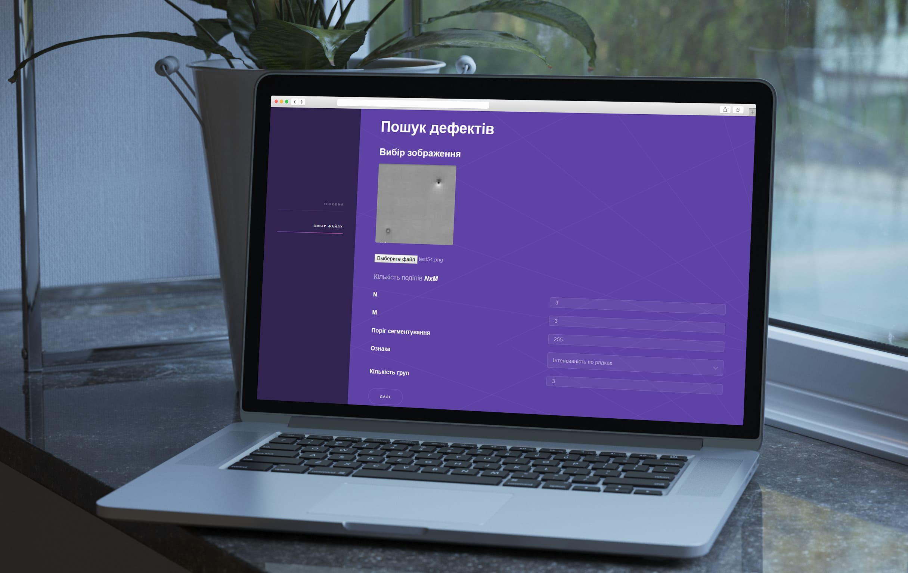
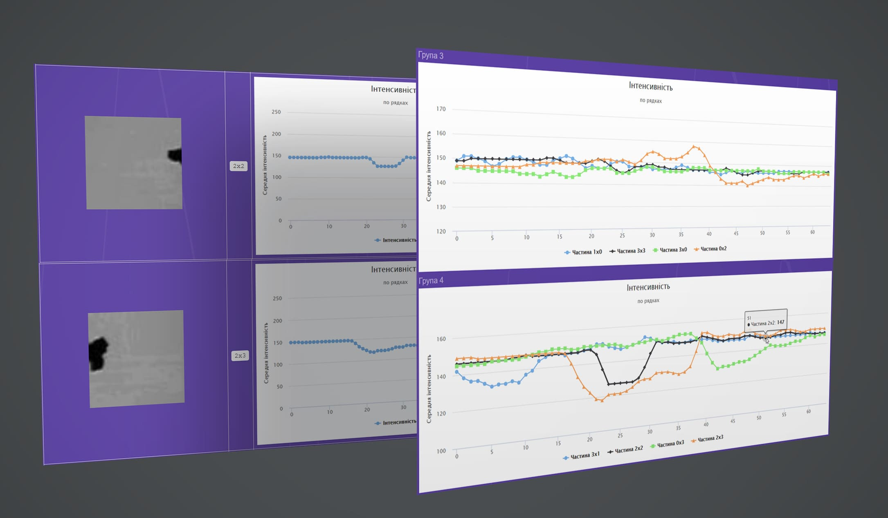
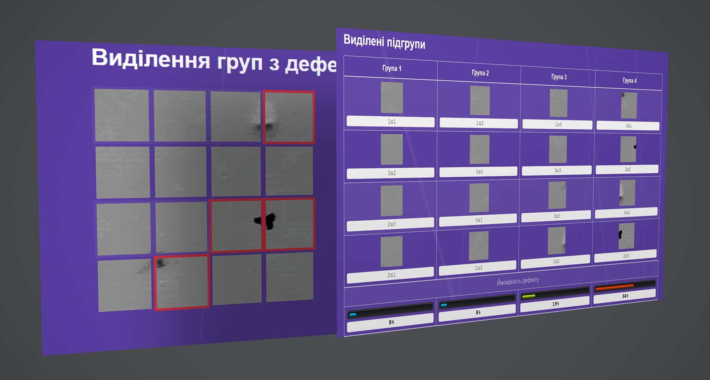
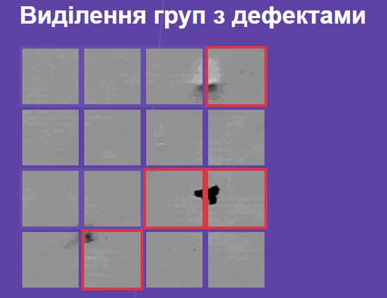
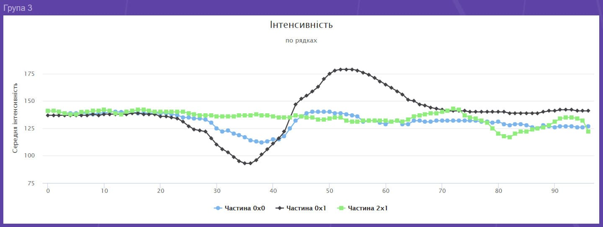

# Material Defect Analyzer

[](https://github.com/tegos/material-defect-analyzer/actions/workflows/ci.yml)

A web application that detects and classifies defective regions in material surface images using a custom pixel-level feature extraction and distance-matrix clustering algorithm.

---

## How It Works

The analysis pipeline runs entirely server-side in PHP using the GD image library, with no third-party ML dependencies.

**1. Upload and preprocess**

The user uploads an image and sets three parameters: the grid dimensions (how many rows and columns to divide the image into), a pixel intensity threshold, and the number of groups to classify segments into. The image is immediately converted to greyscale.

**2. Grid segmentation**

The greyscale image is divided into a uniform N x M grid. Each cell becomes an independent segment. The grid overlay is rendered and saved so the user can see the exact boundaries.

**3. Feature extraction per segment**

For each segment, one of four feature vectors is computed, depending on the algorithm the user selected:

- **Intensity by rows** - for each row in the segment, compute the average pixel brightness (0-255) across all columns in that row. The result is a 1D array with one value per row.
- **Intensity by columns** - the same computation applied column-by-column.
- **Silhouette by rows** - instead of averaging, take the maximum brightness value in each row.
- **Silhouette by columns** - the same maximum projection applied column-by-column.

The threshold parameter caps any pixel value above the threshold at 255 before computing these statistics, which lets the user ignore highlights or wash out over-exposed areas.

**4. Pairwise distance matrix**

Once every segment has a feature vector, the algorithm computes a distance matrix across all segment pairs. The distance between two segments is the mean squared difference between their feature vectors, element by element. A perfectly uniform material would produce near-zero distances everywhere.

**5. Clustering into groups**

The Matrix class groups segments by iteratively finding the pair with the smallest mutual distance and assigning them to the same cluster. This continues until all segments are distributed into the requested number of groups. Groups are sorted by total intra-group distance, so the group with the most internally dissimilar segments (i.e. the most inconsistent texture) rises to the top.

**6. Defect scoring and highlighting**

For each segment, a defect score is derived from the variance of its feature vector: specifically, the square root of the sum of the minimum and maximum squared deviations from the segment mean. Scores are normalized across all segments so they sum to 1, then aggregated per group. Any group whose share exceeds 40% is flagged as a danger group and its corresponding segments are highlighted in red on the grid visualization.

**7. Interactive chart overlay**

The front end renders Highcharts line charts for any segment on hover, showing the raw feature vector so the user can inspect exactly what the algorithm saw. A group comparison chart plots all segments in a selected group on the same axes for direct comparison.

---

## Features

- Upload any image (JPEG, PNG, GIF) and analyze it without preprocessing
- Four feature extraction algorithms selectable per analysis session
- Configurable grid resolution, intensity threshold, and number of groups
- Distance matrix visualization showing pairwise similarity across all segments
- Automatic defect group highlighting when variance concentration exceeds threshold
- Per-segment and per-group Highcharts line chart overlays
- Per-group defect percentage bar with color-coded severity levels
- All processing done server-side with PHP GD - no Python, no ML runtime dependencies

---

## Tech Stack

| Layer | Technology |
|---|---|
| Backend | PHP 8.4, Laravel 12 |
| Image processing | PHP GD, Intervention Image 3.x |
| Database | MySQL 8.0 |
| Charts | Highcharts (JavaScript) |
| Frontend | Blade templates, jQuery |
| Runtime | Docker Compose |

---

## Screenshots



<br/>




<br/>




---

## Getting Started

### Requirements

- Docker and Docker Compose

### Installation

```bash
git clone https://github.com/tegos/material-defect-analyzer.git
cd material-defect-analyzer

cp .env.example .env
docker compose up -d
docker compose exec app php artisan key:generate
```

The container entrypoint runs `storage:link` and `migrate` automatically on startup.

Open `http://localhost:8080` in your browser.

### Tests

```bash
docker compose exec app php artisan test
```

---

## Usage

1. On the home page, select a feature extraction algorithm and enter the grid dimensions (N columns, M rows).
2. Upload a material surface image (JPEG, PNG, or GIF). Color images are converted to greyscale automatically.
3. Set the number of output groups and, optionally, a pixel intensity threshold (0-255) to suppress over-bright regions.
4. Click Submit. The analysis page shows the image divided by the grid, the full pairwise distance matrix, per-group defect percentages, and any danger segments highlighted in red.
5. Click any segment thumbnail to load its feature vector as an interactive Highcharts line chart. Use the group comparison chart to overlay all segments within the same group on one axis.

---

## Project History

Built as a university diploma project in 2017. Upgraded to Laravel 12 / PHP 8.4 in 2026.

---

## Publications & Academic References

Backed by official academic research published in the proceedings of the **International Scientific Conference "Information Technology and Interactions" (IT&I-2017)**, Kyiv, November 2017.

**Citation:**
> Melnyk, R. A., & Mykhavko, I. V. (2017). *Web application for surface defects detection by classifying characteristics of its image parts*. Proceedings of the International Scientific Conference "Information Technology and Interactions" (IT&I-2017). Kyiv, 2017. P. 14.

- **Conference Program:** Article listed on page 14 of the official [IT&I-2017 Conference Program PDF](http://iti.fit.univ.kiev.ua/wp-content/uploads/%D0%9F%D1%80%D0%BE%D0%B3%D1%80%D0%B0%D0%BC%D0%B0-%D0%BA%D0%BE%D0%BD%D1%84%D0%B5%D1%80%D0%B5%D0%BD%D1%86%D1%96%D1%97-%D0%86%D0%A2%D0%86_2017.pdf).

---

## License

This project is licensed under the MIT License. See the [LICENSE](LICENSE) file for details.
